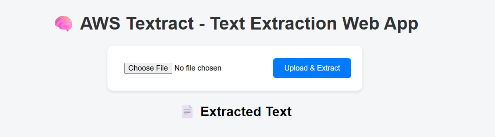
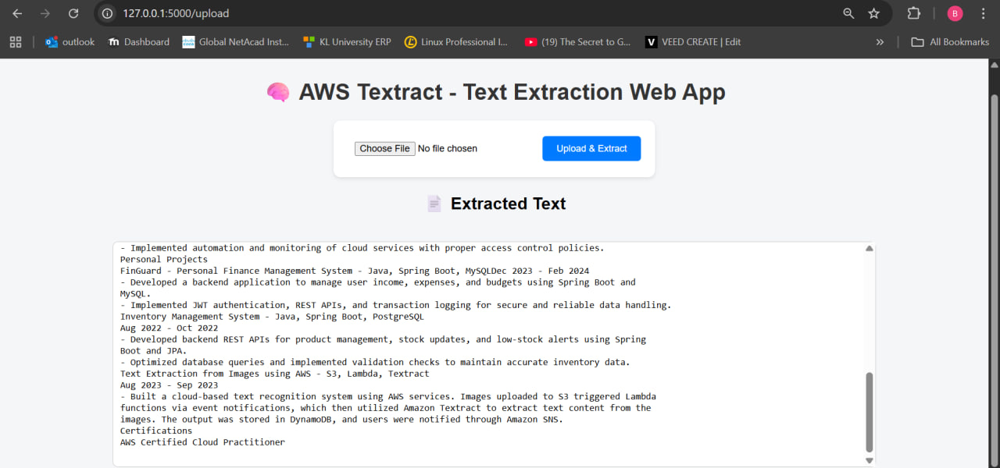

# 🧠 Text Extraction from Images using AWS Textract

This is a Flask-based web application that allows users to upload images through a simple web UI. The uploaded image is stored in AWS S3, processed using AWS Textract to extract text, and both the image details and extracted text are stored in AWS DynamoDB.

---

## 👩‍💻 About the Project

This project was built by me as a student learning cloud and full-stack development. It helped me understand how to integrate multiple AWS services (S3, Textract, DynamoDB) with a Python Flask backend and connect them using the Boto3 SDK.

I created this project to learn how real-world applications handle:
- File uploads  
- Cloud storage  
- Text extraction (OCR)  
- Database storage  
- Web UI integration  

---

## 🚀 Features

✅ Upload image files (JPG, PNG, etc.) from the web interface  
✅ Store uploaded images in AWS S3  
✅ Use AWS Textract to automatically extract text from the image  
✅ Save the extracted text and metadata into AWS DynamoDB  
✅ Display the extracted text instantly on the webpage  

---

## 🖼️ Screenshots

### 🧩 Upload Page

### 📄 Extracted Text Result

---

## ⚙️ Tech Stack

| Component | Technology Used |
|------------|-----------------|
| Frontend | HTML, CSS (Flask Templates) |
| Backend | Python (Flask Framework) |
| Cloud Services | AWS S3, AWS Textract, AWS DynamoDB |
| SDK Used | Boto3 |
| Environment Management | Python-dotenv |

---

## 🧾 AWS Services Overview

### 🪣 Amazon S3
Used to store the uploaded image files securely in the cloud.

### 📖 Amazon Textract
Performs Optical Character Recognition (OCR) on uploaded images and extracts the text content.

### 🗃️ Amazon DynamoDB
Stores the extracted text, filename, and timestamp for future reference.

---

## 🛠️ Project Setup

1️⃣ Clone the Repository  
git clone https://github.com/UtthamkumarBikki/Text_Extraction.git  
cd Text_Extraction  

2️⃣ Create a Virtual Environment  
python -m venv venv  
venv\Scripts\activate   (For Windows)  
or  
source venv/bin/activate   (For macOS/Linux)  

3️⃣ Install Dependencies  
pip install -r static/requirements.txt  

4️⃣ Add Your AWS Credentials  
Create a .env file in the root folder with the following details:  
AWS_ACCESS_KEY=YOUR_ACCESS_KEY  
AWS_SECRET_KEY=YOUR_SECRET_KEY  
REGION=ap-south-1  
BUCKET_NAME=your-s3-bucket-name  
TABLE_NAME=your-dynamodb-table-name  

5️⃣ Run the App  
python app.py  

Now open your browser and visit:  
http://127.0.0.1:5000/

---

## 📂 Folder Structure

Text_Extraction/  
│  
├── app.py                   → Main Flask application  
├── .env                     → AWS credentials (hidden in .gitignore)  
├── .gitignore               → Files to ignore in GitHub  
├── static/  
│   ├── style.css            → Frontend styling  
│   └── requirements.txt     → Dependencies list  
├── templates/  
│   └── index.html           → HTML UI  
├── images/  
│   ├── img1.jpg             → Screenshot 1  
│   └── img2.jpg             → Screenshot 2  
└── README.md  

---

## 💡 Learning Outcome

Through this project, I learned:  
- How to connect Flask with AWS services using Boto3  
- How OCR works using AWS Textract  
- How to store and retrieve data from AWS DynamoDB  
- How to design a simple web interface for cloud-based applications  
- How to deploy and version control projects using Git and GitHub  

---

## 🌟 Future Improvements

- Add user authentication (AWS Cognito)  
- Display previous upload history from DynamoDB  
- Deploy on AWS Elastic Beanstalk or EC2  
- Add PDF text extraction  

---

## 🙌 Author

👤 **Uttham Kumar Goud Bikki**  
🎓 B.Tech in Computer Science (Cloud Computing Specialization)  
💼 Aspiring Backend Developer | Cloud Enthusiast  
📧 Email: 2100031145cseh@gmail.com  
🔗 [GitHub](https://github.com/UtthamkumarBikki)

---

## 🏁 Conclusion

This project showcases the power of integrating Flask with AWS Cloud Services to create intelligent applications.  
It’s a great learning project for students exploring Cloud + Full Stack Development.

---
